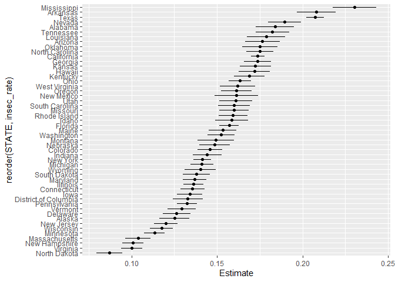
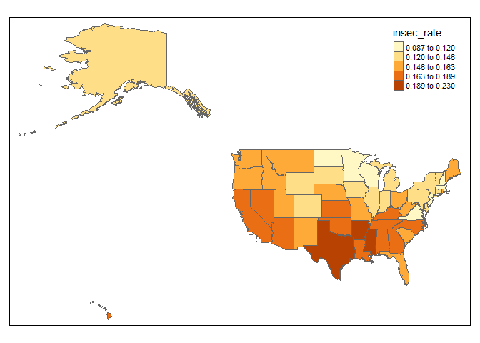

Geog 4/6300: Lab 4
================

## Confidence intervals and sampling

**Your name: {Sam Shuster}**

**Overview:**

In this lab, we will be calculating estimated food insecurity at state
level. We will be using individual level “microdata” from the Current
Population Survey (CPS). It is designed as an ongoing (collected
monthly) set of data on financial and demographic characteristics. One
main use of the CPS is to calculate national levels of food insecurity.
Each December, a food security supplement is added to the regular
survey, and data from the supplement is included here.

To load these data, load the csv file, which is included in the lab
folder:

``` r
cps_data<-read_csv("data/IPUMS_CPS_FoodSec.csv")
```

This contains a csv file with microdata from the CPS that is
de-identified and publically available through the Minnesota Population
Center (<https://cps.ipums.org/cps/index.shtml>). There is also a
codebook that is part of the Github repo (IPUMS\_CPS\_CODEBOOK.pdf)
describing each of those variables.

\#\#\#Part 1: Calculating national food insecurity\#\#\# For this lab,
you will be using the FSSTATUS variable, which describes the food
security of respondents. While food security status is often grouped
into “low” and “very low” food security, these two are often just
combined to a single measure: food insecure. The codebook (see the link
above) lists the values assocated with missing or “Not in universe”
(NIU) records. For the purposes of this lab, an additional column called
FSSTATUS\_cat has been added with text versions of the FSSTATUS
classification: food\_secure, low\_fs, and “verylow\_fs”.

**Question 1 (4 points)** *Filter out all records in this dataset that
have missing or NIU observations for food insecurity. Then use group\_by
and summarise to calculate the number of individuals grouped in each
food security category (FSSTATUS). Call this table using kable. Based on
these results, calculate the estimated national food insecurity rate
(those rated 2 and 3).*

``` r
# single equals sign operator (=) also works in place of <-
records_present<-cps_data%>%
  filter(FSSTATUS_cat != "NA")%>%
  group_by(STATE)%>%
  summarise(sec_count = sum(FSSTATUS == 1), 
            lowsec_cnt = sum(FSSTATUS == 2), 
            vlowsec_cnt = sum(FSSTATUS == 3),
            )
```

    ## `summarise()` ungrouping output (override with `.groups` argument)

``` r
kable(head(records_present))
```

| STATE      | sec\_count | lowsec\_cnt | vlowsec\_cnt |
| :--------- | ---------: | ----------: | -----------: |
| Alabama    |       3877 |         578 |          295 |
| Alaska     |       4721 |         449 |          226 |
| Arizona    |       4347 |         600 |          332 |
| Arkansas   |       3927 |         675 |          356 |
| California |      30294 |        4318 |         2054 |
| Colorado   |       7984 |         872 |          491 |

``` r
totSec=sum(records_present$sec_count)
totLow=sum(records_present$lowsec_cnt)
totVLow=sum(records_present$vlowsec_cnt)
totPop=totSec + totLow + totVLow
totInsec=totLow+totVLow
insec_p_hat=totInsec/totPop # this is the "rate" or sample proportion of insecure
```

**Question 2 (3 points)** *Using the formula for confidence intervals
for proportions shown in class, calculate a confidence interval for the
rate you identified in question 1. Make sure that confidence interval is
shown in the knitted document you create. Interpret what that confidence
interval tells you.*

``` r
z_score95<- 1.96
stder<-sqrt(insec_p_hat-(1-insec_p_hat)/totPop)
stder_num<-(insec_p_hat*(1-insec_p_hat))
MargErr = (sqrt(stder_num/totPop)*z_score95)


# SE= sample standard deviation/sqrt(sample)
CI_upper = insec_p_hat + MargErr
CI_lower = insec_p_hat - MargErr
```

A confidence interval of 95% yields us values of (0.1517, 0.1539). The
range presented as percentages is 15.17% and 15.39%. This represents the
percentage of people who fall within the “insecure” population.

\#\#\#Part 2: Analyzing state food insecurity data\#\#\#

We can also use the “STATE” variable to calculate rates for each state.
You can adapt the code from question 1 above to include STATE as a
second grouping variable.

**Question 3 (5 points)** *Create an estimated food insecurity rate for
each state from these data. To do so, you’ll need to create counts for
each response (food secure, low food security, very low food
insecurity), and transform the data so all three are in the same row
(rather than spread out the long way across three rows). You can then
sum the latter two variables and divide by the total responses within
each state. Call the head of your table when done using kable.*

``` r
food_sec_rates<-cps_data%>%
  filter(FSSTATUS_cat != "NA")%>%
  group_by(STATE)%>%
  summarise(sec_count = sum(FSSTATUS == 1), 
            lowsec_cnt = sum(FSSTATUS == 2), 
            vlowsec_cnt = sum(FSSTATUS == 3), 
            insec_cnt = sum(lowsec_cnt + vlowsec_cnt), 
            tot_pop = sum(sec_count + insec_cnt))%>%
  ungroup()%>%
  select(STATE, sec_count, insec_cnt, tot_pop)%>%
  mutate(insec_rate = (insec_cnt/tot_pop))
```

    ## `summarise()` ungrouping output (override with `.groups` argument)

``` r
  #mutate(totpop = sum(sec_count + lowsec_cnt + vlowsec_cnt))

kable(head(food_sec_rates))
```

| STATE      | sec\_count | insec\_cnt | tot\_pop | insec\_rate |
| :--------- | ---------: | ---------: | -------: | ----------: |
| Alabama    |       3877 |        873 |     4750 |   0.1837895 |
| Alaska     |       4721 |        675 |     5396 |   0.1250927 |
| Arizona    |       4347 |        932 |     5279 |   0.1765486 |
| Arkansas   |       3927 |       1031 |     4958 |   0.2079468 |
| California |      30294 |       6372 |    36666 |   0.1737850 |
| Colorado   |       7984 |       1363 |     9347 |   0.1458222 |

**Question 4 (2 points)** *Create code that estimates the error term
(the standard error \* the z score for 95% confidence) for each state.*

``` r
ME_estimator<-food_sec_rates%>%
  mutate(Margin_Error = 1.96 * sqrt((insec_rate*(1-insec_rate))/tot_pop))%>%
  mutate(ci_low = insec_rate - Margin_Error)%>%
  mutate(ci_high = insec_rate + Margin_Error)
```

**Question 5 (2 points** *Explain the purpose of each function you used
in question 4.*

Most of the leg-work so to speak was already finished. I used the
food\_sec\_rates data frame I created in order to utilize the sample
proportion column (insec\_rate) I had already created. I used the mutate
function in order to create a new column with the new calculated Margin
of Error for each state. I used mutate to preserve the data from the
food\_sec\_rates df while adding a new column. Within the mutate
function is the formula required to calculate the margin of error from
the preexisting data from the food\_sec\_rates df.

**Question 6 (2 points)** *Create a graph of the confidence intervals
from question 4 using ggplot, geom\_line, and geom\_point as shown in
class. Arrange the states along the y axis based on the estimated food
insecurity rate. See the code shared in class lectures for a template to
work from.*

``` r
graph_df<-ME_estimator%>%
  pivot_longer(c(ci_low, ci_high), names_to = "ci", values_to = "Estimate")
  
ggplot(graph_df)+
  geom_line(aes(x=Estimate, y = reorder(STATE, insec_rate), group=STATE))+
  geom_point(aes(x=insec_rate, y = STATE))
```

<!-- -->

**Question 7 (3 points)** *Compare the margin of error (error term) you
calculated for Georgia to the national margin of error. How do they
differ? Mathematically, why are they different?*

Georgia appears to have a larger number for its margin of error. The
national margin of error is smaller because the calculation for it
factors in many more observations and a larger data set that is
normalized by its size. Georgia, by comparison, has fewer observations
with which to calculate the sample proportion. Because of this, the
sample proportion is effected more heavily by each observation compared
to the proportion found for the entire country. The bigger the sample,
the smaller the CI.

**Question 8 (3 points)** *Create a column in your state food insecurity
estimates that converts each state’s food insecurity rate to a z score
based on the whole population. What is the z score for New Jersey? What
does that z score tell you?*

``` r
zscore_calc<-ME_estimator%>%
  mutate(mean_insec=mean(insec_rate))%>%
  mutate(stddev=sd(insec_rate))%>%
  mutate(state_zscore = (insec_rate - mean_insec)/stddev)
```

The Z score tells us how far each data value is from the mean of a data
set using Standard Deviation as the basis of measurement. The Z-score
for the state of New Jersey is -1.123563981, which indicates that it is
1.124 standard deviations below the mean score for all states.

\#\#\#Part 3: Sampling\#\#\#

***Question 9 (3 points)*** *Preliminary data from a state health survey
showed a food insecurity rate of 19%. Using the distribution of state
food insecurity rates as a reference, what is the percentile rank of
this value? You will need to calculate the mean and standard deviation
of the existing state rates to answer this question. Use the
scripts/lectures on probability distributions as a reference.*

``` r
pct_rank<-pnorm(.19, mean = zscore_calc$mean_insec, sd = zscore_calc$stddev)
```

Percentile rank falls within the 90th percentile.

**Question 10 (3 points)** *Health officials would like to do a related
survey of household food insecurity in Atlanta with enough responses to
allow for margins of error under 2% (with 95% confidence). Assume that
the rate is similar to the one you identified for Georgia in question 5.
Use R to compute how big a sample they would need.*

``` r
ATL_samp_size<-(1.96^2/.02^2) * (.17367540 * (1-.17367540))
```

**Extra credit\!\! (2 points)** A geojson file of state boundaries is
included in this lab repo. Using the state rate estimates you created
for question 3, create a map that shows these rates. You’ll have to join
your estimates to the state boundaries before you visualize them.

``` r
state_boundaries<-st_read("data/USstates.geojson")
```

    ## Reading layer `USstates' from data source `C:\Users\samsh\OneDrive\Documents\Productivity\College\GEOG4300 Data Science in GIS\Lab 4\geog4-6300-lab4-PhishRfriends\data\USstates.geojson' using driver `GeoJSON'
    ## Simple feature collection with 51 features and 12 fields
    ## geometry type:  MULTIPOLYGON
    ## dimension:      XY
    ## bbox:           xmin: -178.2176 ymin: 18.92179 xmax: -66.96927 ymax: 71.40624
    ## geographic CRS: WGS 84

``` r
#Start with spatial object and then join non-spatial data to it.
spat_join<-state_boundaries%>%
  inner_join(food_sec_rates)
```

    ## Joining, by = "STATE"

``` r
tm_shape(spat_join)+
  tm_polygons("insec_rate", style = "jenks")
```

<!-- -->
